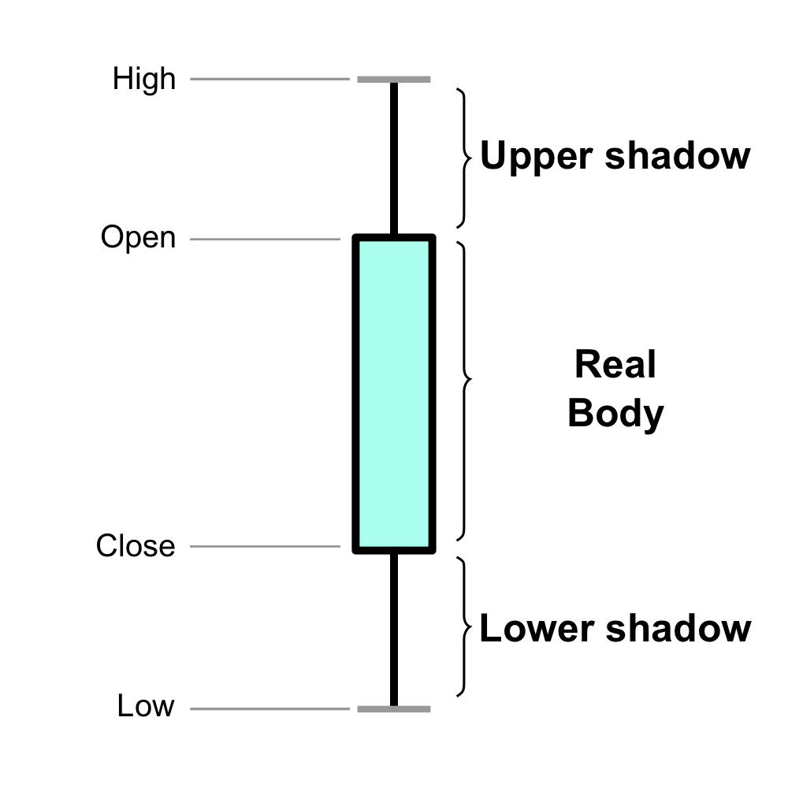

# Intro Class

```{r setup, include=FALSE}
knitr::opts_chunk$set(echo = TRUE)
```

* Chapters 1, 2, and 4: 
  * Obtaining financial data; 
  * principles of financial data science; 
  * exploratory (or empirical) data analysis, 
  * calculating asset returns
  
```{r set-options, echo=FALSE, cache=FALSE}
options(width = 80)
```  

## Getting Acquainted with R and RStudio

R is a programming language for statistical computing and graphics. It is widely
used among statisticians and contains a large number of ready-to-use functions
(called packages).

Start by installing R. Please visit: 
<center>
https://www.r-project.org/.
</center>

For Jupyter Notebook style, visit: 
<center>
colab.fan/r
</center>

This will install the R software. It is also recommended to install an IDE
(integrated development environment) for R, such as RStudio. Please visit:
<center>
https://www.rstudio.com/products/rstudio/download/.
</center>

### Install "Quantmod"

There are many online resources to learn R. I will briefly explain the codes
presented in each class. However, you should thoroughly examine each code on
your own, and use the R documentation to learn how the are used.

Let us open RStudio, and install our first package. As mentioned before,
packages include ready-to-use functions. quantmod is a package that can be used
for obtaining financial data.

To install the package use Tools -> Install Packages... menu in RStudio, or
directly use the following command:

```{r eval=FALSE, include=TRUE}
install.packages("quantmod")
```


### Obtaining financial data

However, to be able to use an installed package, we need to load it. This is
done by the following command.

```{r,eval=TRUE, inclue=TRUE, echo=TRUE}
library('quantmod')
```

As you can see, R automatically load other packages that quantmod relies on, namely, packages xtx and zoo (both are packages that define time-series data types).

quantmod provides the function getSymbols() which can be used to find historical financial and economical data from various online resources.

Let us load historical data from Apple Inc. from Yahoo! finance. 
First, we need to find the symbol for apple. 
Searching the web, we find the symbol at
<center>
https://finance.yahoo.com/quote/AAPL/
</center>

Thus, the symbol is AAPL.  Now, we can use the following R command to obtain the
data.


```{r}
getSymbols("AAPL", from="2007-01-01", to="2018-05-30", src="yahoo")
```

We have obtained the historical data of symbol AAPL, from January 2007 until May
2018, using the data source yahoo (Yahoo! finance), and store it as a variable
called AAPL.

```{r}
class(AAPL)
```
The variable is an extended time series (xts) object, which is a subclass of type zoo. These are essentially 2 dimensional arrays, where the index rows are date/time objects.


To get the total number of rows and columns, we can use:

```{r}
dim(AAPL)
```

So, AAPL has 2871 rows (trading days) and 6 columns.

```{r}
names(AAPL)
```


* open price (the first trade of the day), 
* high price (the highest price of the day), 
* low price (the lowest price of the day), 
* close price (the last trade of the day), 
* volume (the total number of shares traded during the day),
* the adjusted prices (the price that is adjusted to include the effect of
corporate events such as dividend payments and stock splits, more on this
later)

### Subset by Position
To get the first few rows of the xts object, we can use the function head(), and
to get the last few rows, we can use the function tails().


```{r echo=TRUE}
head(AAPL,n=5)
```


```{r echo=TRUE}
tail(AAPL,n=5)
```


### Subset by Date Range


```{r}
AAPL["2015-12-23/2015-12-24"]
```


```{r}
AAPL['2015-12'] 
```


### Visualize Data as Timeseries


```{r, fig.align='center'}
chartSeries(AAPL, theme="white", echo=TRUE)
```

*** 

```{r, fig.align='center', echo=TRUE}
chartSeries(AAPL, theme="white", subset="2015-12-15::2015-12-31")
```


### Understanding chartSeries
* What does <code>chartSeries</code> do? 
```{r eval=F}
?chartSeries
```

* What is __OHLC__ charts?
<center>
```{r pressure, echo=FALSE, fig.cap="OHLC", out.width = '40%'}

```
</center>

### Obtain Unemployment Data
We can use other sources to obtain data. For example, let us obtain monthly
unemployment rate from Federal Reserve Economic Data (FRED). 

We may find the symbol for unemployment rate in the following page
<center>
https://fred.stlouisfed.org/series/UNRATE, 
</center>

which reveals that the symbol is UNRATE. 


```{r}
getSymbols("UNRATE",src="FRED")
```


### Visualize Unemployment Data

```{r}
dim(UNRATE)
head(UNRATE)
tail(UNRATE)
```

***

```{r, fig.align='center'}
chartSeries(UNRATE, theme="white")
```


## Asset Return

### Single Period Return

* Let $P_0, P_1, \ldots$ be the price of an equity.  For now, let's assume no
"corporate actions" such as dividends, split, etc.
* Net return over $[t-1,t]$:

$$
R_t:= (P_t-P_{t-1})/P_{t-1}.
$$

* Gross return over $[t-1,t]$ is

$$
P_t/P_{t-1} = 1+R_t
$$

* Log returns over $[t-1,t]$: 

$$
r_t := \log({P_t}/{P_{t-1}})
$$

### Multi Period Returns
* $R_t(k)$, the net return over $[t-k,t]$, is given by:

$$ 
\begin{aligned}
R_t(k) 
& := \frac{P_t}{P_{t-k}} - 1 \\
& = (1+R_t)(1+R_{t-1})\cdots(1+R_{t-k+1}) -1,
\end{aligned}
$$

* $r_t(k)$, the log return over $[t-k,t]$, is given by:

$$
\begin{aligned}
r_t(k) 
& := \log\frac{P_t}{P_{t-k}} \\
& = r_t + r_{t-1} + \cdots + r_{t-k+1}
\end{aligned}
$$


### Simple Example

The following table gives two daily (adjusted) closing price of Apple stock in Dec. 2015
<center>
<table>
<thead><tr>
<th>Date</th>
<th>12/23</th>
<th>12/24</th>
</tr>
</thead>
<tbody>
<tr>
<td>Price(\$)</td>
<td>104.56</td>
<td>104.00</td>
</tr>
</tbody>
</table>
</center>

* Gross (daily) return on 12/24 is  
$$104/104.56=0.994644$$
* Net return on 12/24 is  
$$0.994644-1=−0.005356$$
* Log return on 12/24 is  
$$\log(104.00)−\log(104.56)=−0.005370$$


### Approximation Example

* For small  $|x|$ , we have  
$$
x\approx \log(1+x),
$$
whence log and net returns are good approximation of each other

* Suppose that we use log returns instead of net returns. 
	+ How are our estimations? for losses and for gains?

*** 

```{r, fig.align='center', fig.keep='last'}
x=seq(-1,1,by=0.01)
y = log(1+x)
plot(x,y,type='l')
abline(a=0,b=1,col='red')
```


## Adjusted Price

There are many market events that makes our return formula inappropriate for
quoted prices, e.g. dividend payments, stock splits, etc.

### Net Return with Dividend

Let $D_1$, $D_2$, ... be the dividends of a stock with quoted prices 
$P_1, P_2,\ldots$, where $D_t$ is the dividend paid at $t$.
The appropriate definition of the net return __should__ be
$$
R_t = \frac{P_t + D_t - P_{t-1}}{P_{t-1}}.
$$
Similarly,  the multi-period net return $R_t(k)$ __should__ be
$$
\begin{aligned}
&\quad 1+ R_t(k) \\
& = (1+R_t)(1+R_{t-1}) \dots (1+R_{t-k+1})\\
&= \left(\frac{P_t+D_t}{P_{t-1}}\right)\left(\frac{P_{t-1}+D_{t-1}}{P_{t-2}}\right)\cdots\left(\frac{P_{t-k+1}+D_{t-k+1}}{P_{t-k}}\right) \\
&\ne \frac{P_t}{P_{t-k}}
\end{aligned}
$$

### The idea behind "adjusted prices"
Find prices $\widetilde P_{t_1}$, $\widetilde P_{t_2}$, ..., such that
return are given by "simple" formulas applied to $\widetilde P_t$. In other words, we __want__
$$
\begin{aligned}
&\quad 1+R_t  = \frac{\widetilde{P}_t}{\widetilde{P}_{t-1}}\\
& \Longrightarrow\frac{P_t + D_t}{P_{t-1}} = \frac{\widetilde {P}_t}{\widetilde {P}_{t-1}}\\
& \Longrightarrow\widetilde P_t = \left(\frac{P_t+D_t}{P_{t-1}}\right) \widetilde P_{t-1}
\end{aligned}
$$

* There are many such adjustment for different types of events. Always use
"adjust prices" to calculate returns.

### Using Adjusted AAPL Prices

* Next, we show two ways to calculate asset returns using R. Let us first obtain
the prices of Apple Inc.

```{r}
getSymbols("AAPL", from="2017-10-03", to="2017-10-13", src="yahoo")
names(AAPL)
```


### Adjusted Prices

As mentioned before, the adjusted price is the column AAPL.Adjusted. We can
obtain the column by using the $ operator:

```{r}
AAPL$AAPL.Adjusted
```


### Log and Net Return of AAPL

One can use the lag() and diff() functions (take a look at
the R documentation to learn what they do).


```{r}
P <- AAPL$AAPL.Adjusted
R <- diff(P)/lag(P)
class(R)
```

```{r}
r <- diff(log(P))
class(r)
```

*** 


```{r}
head(r)
head(R)
```


Let us calculate the net and log returns for a longer period and plot the result.

```{r}
getSymbols("AAPL", from="2007-01-03", to="2017-10-13", src="yahoo")
AAPL.rtn = diff(AAPL$AAPL.Adjusted)/lag(AAPL$AAPL.Adjusted) # Compute net returns
colnames(AAPL.rtn)[1] = "net"
AAPL.rtn$log = diff(log(AAPL$AAPL.Adjusted)) # Compute log returns
head(AAPL.rtn)
```


```{r, fig.align='center'}
chartSeries(AAPL.rtn$net, name = "Net-returns of Apple Inc.", theme=chartTheme("white", up.col='black'))
```

*** 

```{r, fig.align='center'}
chartSeries(AAPL.rtn$log, name = "log-returns of Apple Inc.", theme=chartTheme("white", up.col='black'))
```


